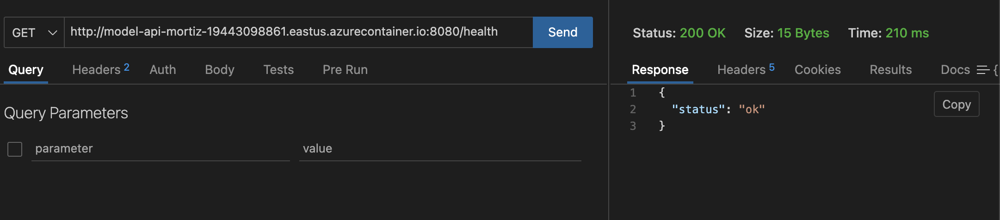
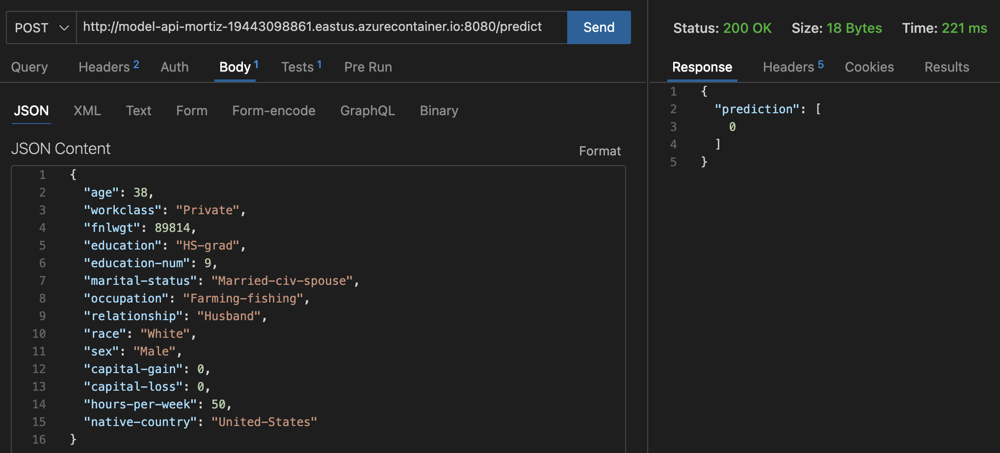
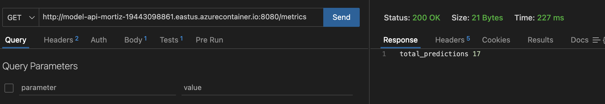
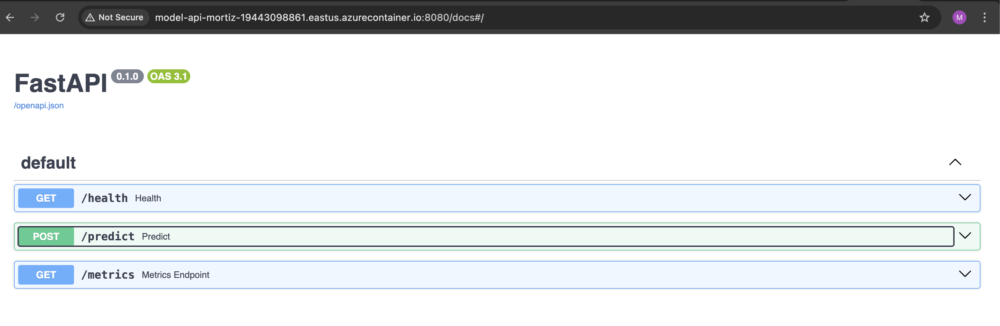

# pontia-mlops-tutorial — Adult Income Prediction

<p align="center">
  
  
  
</p>

[](https://github.com/mortizdev4028/pontia-mlops-tutorial-marcos-ortiz/actions)
[](https://github.com/mortizdev4028/pontia-mlops-tutorial-marcos-ortiz/actions)
[](https://github.com/mortizdev4028/pontia-mlops-tutorial-marcos-ortiz/actions)


---

## 👨‍🎓 Datos del Alumno

- **Marcos Ortiz** — [mn.ortiz.rivera@gmail.com](mailto:mn.ortiz.rivera@gmail.com)

---

## 📊 Descripción del Proyecto

Este proyecto implementa un pipeline completo de MLOps para entrenar, versionar y desplegar un modelo que predice si una persona gana más de 50K USD anuales usando el dataset Adult Income. El flujo automatiza CI/CD, construcción, registro en MLflow, generación de imagen Docker y despliegue en Azure Container Instances con una API FastAPI.

 El resultado final es accesible desde Python, Postman y cualquier herramienta para consumir APIs.

---

## 📁 Estructura del Repositorio

```
.
├── workflows/         # Pipelines de GitHub Actions
│   ├── integrate.yml  # CI - integración continua
│   ├── build.yml      # Build, entrenamiento y registro MLflow
│   └── deploy.yml     # Despliegue a Azure
│
├── data/
│   └── raw/           # Datasets (descarga dinámica por pipeline)
│
├── deployment/        # Infra Docker + FastAPI
│   ├── Dockerfile     
│   └── fastapi.yml    
│
├── mode_test/         # Pruebas de integración/performance del modelo
├── models/            # Artefactos .pkl
├── scripts/           # register_model.py y queries
├── src/               # Código fuente
│   ├── train.py       
│   ├── preprocessing.py
│   └── model.py       
├── unit_test/         # Tests unitarios
├── .gitignore         
├── requirements.txt   
└── README.md          
```

> 🔎 **Notas:**

> - `data/raw` se mantiene vacía; los datos se descargan dinámicamente.
> - `deployment` contiene Dockerfile y configuración FastAPI.
> - `models` almacena los artefactos .pkl generados, se mantiene vacía
> - `mode_test` para pruebas del modelo completo performance.
> - `scripts` para registro y consultas.
> - `src` contiene el código de entrenamiento.
> - `unit_test` contiene pruebas unitarias que validan en CI/CD mediante GitHub actions.

---

## 🚀 Primeros Pasos de la práctica

1. Crear el repo: **pontia-mlops-tutorial-marcos-ortiz**
2. Descargar el código base: [pontia-mlops-tutorial](https://github.com/merlindk/pontia-mlops-tutorial)

---

## 🔒 Configuración de GitHub (Ruleset y Secretos)

- Restricción de borrado/force-push en main
- Status checks obligatorios, apuntando a integrate.yml (GitHub Actions)
  - Ruleset deshabilitado para permitir avance de proyecto en formato offline
- Secretos: `AZURE_STORAGE_CONNECTION_STRING`, `AZURE_CREDENTIALS`, `ACR_mortizdev4028`, etc.
- Variables: `MLFLOW_URL`, `EXPERIMENT_NAME`, `MODEL_NAME`, `MODEL_ALIAS`, etc.

---

## 🔄 Pipelines de GitHub Actions

### 🧪 Integración Continua (`integrate.yml`)
Valida tests en PRs y ejecuciones manuales. Python 3.10, ejecuta unit tests, permite continuar aunque fallen, para incorporar cambios de código en el repo.

### 🏗️ Build (`build.yml`)
Entrena el modelo, descarga el dataset, registra en MLflow, genera artefactos y ejecuta pruebas de integración. Se ejecuta una vez comppletada la anterior.

### 🚚 Deploy (`deploy.yml`)
Construye imagen Docker, publica en ACR y despliega en ACI, con endpoint métricas y system tests, para probar desde URL externa el modelo: http://model-api-mortiz-19443098861.eastus.azurecontainer.io:8080/health

---

## 📝 Flujo de Trabajo Recomendado

- Crear PR → Solicitar revisión → Esperar check `integrate.yml`
- Merge a main → Ejecutar `build.yml`
- Si OK → `deploy.yml` publica y despliega la API en Azure
- Verificar endpoints y métricas

---

## ⚡ API de Inferencia (FastAPI)

- **GET /**               — Healthcheck
- **POST /predict**       — Inferencia
- **GET /metrics**        — Métricas Prometheus

#### Ejemplo payload `/predict`:

```json Payload
{
  "age": 38,
  "workclass": "Private",
  "fnlwgt": 89814,
  "education": "HS-grad",
  "education-num": 9,
  "marital-status": "Married-civ-spouse",
  "occupation": "Farming-fishing",
  "relationship": "Husband",
  "race": "White",
  "sex": "Male",
  "capital-gain": 0,
  "capital-loss": 0,
  "hours-per-week": 50,
  "native-country": "United-States"
```

#### Ejemplo respuesta:

```
Prediction: [0]
```

#### Uso en Python

```python
import requests

url = "http://model-api-mortiz-19443098861.eastus.azurecontainer.io:8080/health"
data = {...}

resp = requests.post(url, json=data, timeout=10)
print(resp.status_code, resp.json())
```

---

## 🖼️ Testing — Capturas de Pantalla

Incluye aquí capturas del uso de la API vía FastAPI, Postman o Python.


Ejemplo:

<p align="center">
  
  
  
  
</p>

---

## 🔐 Protección de la Rama main

Reglas enforceadas:
- No se borra main, no force push
- Status checks y actualización obligatorios antes de merge, haciendo uso de integrate (actions)
- Garantiza cambios auditables y revisados.
---

## 🧪 Testing

- `unit_test`: Tests unitarios sobre `src`
- `mode_test`: Pruebas de integración y performance
- `system_test`: Contra la API en `deploy.yml`

---

## 📦 Entregables

- Link repo GitHub (colaborador [merlinsn@gmail.com](mailto:merlinsn@gmail.com))
- README.md con integrantes, estructura y guía
- 3 pipelines verdes: integrate, build, deploy
- 3 PRs con CR integrado
- Instancia Azure corriendo y saludable

---

## 🛠️ Errores Detectados y Soluciones (Plantilla)

1. **Problema ejecución main local**
   - **Descripción:** Incompatibilidad de paquete pyarrow con la versión de python local 3.14
   - **Solución:** Instalación python 3.10 y seteo como versión por defecto

2. **Problema requirements.txt en docker**
   - **Descripción:** Fallo al ejecutar pip install -r requirements.txt en Dockerfile
   - **Solución:** COPY ejecutado fuera de contexto, se copia fichero al nivel de Deployment antes de llamada a pip

3. **Problema deploy.yml**
   - **Descripción:** Fallos de escritura en uso de vars en actions, $(()) --> ${{}}, fallo en parámetro --environment    al crear el container en Azure.
   - **Solución:** Correción de fallos y prueba de PR para validar flujo completo.
---

## 💡 Notas de Implementación

- Python 3.10 en integrate.yml
- Descargar y limpiar datos en build.yml
- Parametrización y secretos en deploy.yml
- Endpoint `/metrics` en FastAPI
- Dockerfile óptimo (imagen ligera)

---

## 📄 Licencia y Contacto

Proyecto práctico para "Introducción a DevOps".

Contacto profesor: Merlin — [merlinsn@gmail.com](mailto:merlinsn@gmail.com)
